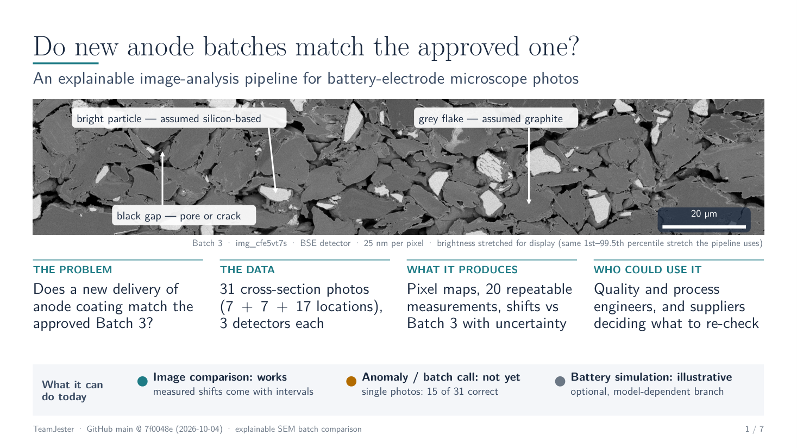

# TeamJester — Polaron Battery-Electrode Image Analysis

**The brief, in one line:** turn SEM/BSE cross-section images of battery-electrode
material into structural measurements (pores, silicon, contacts), compare batches,
and explore what those structures would mean for a physics battery model — while
keeping every claim honest about what the images can and cannot prove.

## 1. Start here: the presentation

📊 **[TeamJester Algorithm Overview (PDF)](Hackathon-Polaron/teamjester_deck/TeamJester_Algorithm_Overview.pdf)** —
7 slides covering the full pipeline: alignment → segmentation → object classification
→ measurement → batch comparison → exploratory DFN.
Editable source: [PPTX](Hackathon-Polaron/teamjester_deck/TeamJester_Algorithm_Overview.pptx) ·
[build + provenance](Hackathon-Polaron/teamjester_deck/)

## 2. The demo: frozen pipeline on 6 never-seen images

We locked the recipe (fitted on Batch_3 only), ran it blind on the
`Hackathon-Polaron-eval` batch, and hash-locked the predictions **before any labels
were released**. Full write-up: **[eval6/REPORT.md](Hackathon-Polaron/eval6/REPORT.md)**
· [predictions CSV](Hackathon-Polaron/eval6/new6_predictions.csv)

| image | envelope pick | session-confound flag | notes |
|---|---|---|---|
| `img_0eryguqq` | Batch_3 | yes — could be session-matched | all three scorers agree |
| `img_4hq27w4c` | **Batch_1** | no | the one clean call (9/9 features inside B1 envelope) |
| `img_fhwrjtet` | Batch_3 | yes | methods disagree — weak call |
| `img_fspqbkxl` | inconclusive (B1/B2) | no | honestly can't tell — batches overlap |
| `img_soo2ax3r` | inconclusive (B1/B3) | no | honestly can't tell |
| `img_y59rxmxl` | inconclusive (B1/B3) | yes | problem photo — low contrast, Si undercount risk |

The demo also ships in the deck: `teamjester_deck/build.sh --new-batch <results>`
regenerates slide 7 with any new batch's scores
([template](Hackathon-Polaron/teamjester_deck/new_batch_results/)).

## 3. What's actually defensible (the honest summary)

- All three batches look like the **same kind of material**: ~6% candidate-Si,
  ~10% resolved porosity, patchy Si, near-horizontal pores, Si clustered beyond
  random.
- The pipeline classifies the **imaging session better than the material** — so
  **no batch/manufacturing difference is claimed**. "Cannot tell," not "identical."
- DFN outputs are conditional what-if indicators, not measured cell performance.

Full evidence trail: [MARKER_SCORECARD.md](Hackathon-Polaron/MARKER_SCORECARD.md) ·
[AUDIT_LEDGER.md](Hackathon-Polaron/AUDIT_LEDGER.md) ·
[RESULTS.md](Hackathon-Polaron/RESULTS.md)

## 4. Inside the repo

| path | what it is |
|---|---|
| `Hackathon-Polaron/teamjester_deck/` | the presentation deck + demo template + rebuild/verify scripts |
| `Hackathon-Polaron/eval6/` | the blind 6-image demo run (hash-locked predictions) |
| `Hackathon-Polaron/micro2dfn/`, `vcompare/` | the measurement pipeline (multi-Otsu → watershed → rule-based classes → markers) |
| `Hackathon-Polaron/dfn_output_v2/` | corrected-marker outputs + exploratory PyBaMM-DFN results |
| `Hackathon-Polaron/validated_comparison/` | batch-comparison statistics + technical appendix |
| `Hackathon-Polaron/teaching_micro2dfn/` | 41-slide masterclass pack for anyone learning the method |
| `Hackathon-Polaron/paper/` | the paper (TeX + PDF) |

Everything else under `Hackathon-Polaron/` mirrors the working directory.
Original TeamJester documentation: [README_UPSTREAM.md](README_UPSTREAM.md)
(forked from [Augustin-Briens/TeamJester](https://github.com/Augustin-Briens/TeamJester)).
